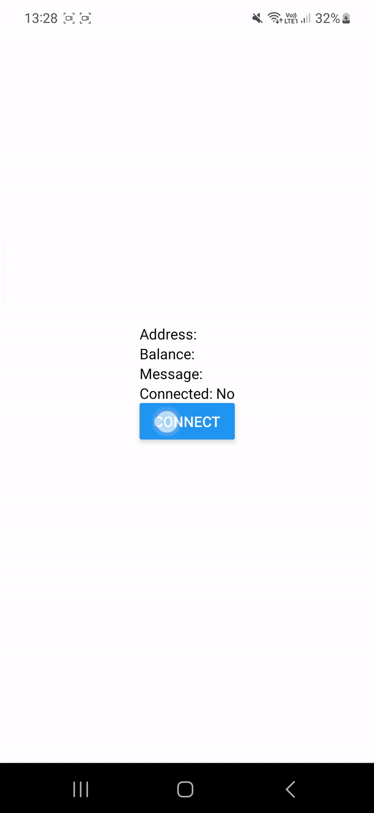
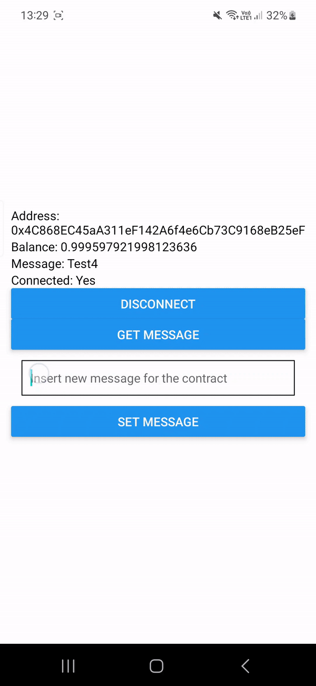

For a simpler version of this project, check out the [ExpoDapp-WalletConnet repo](https://github.com/ManueleNolli/ExpoDapp-WalletConnect)

# Expo Dapp with WalletConnect Ethers Hardhat

This repository is a demo project that demonstrates how to use WalletConnect with Expo and React Native. The project does not require prebuilt or ejected apps.
In addition, the project uses Ethers.js and Hardhat to interact with the Ethereum blockchain (In this case, the Sepolia testnet).

## Demo


<table>
  <tr>
    <th>Wallet Connection</th>
    <th>Transaction</th>
  </tr>
    <tr>
    <td>

    </td>
    <td>
    
    </td>
  </tr>

  
  <table>


## Getting Started

### Prerequisites
For this project, you will need a Sepolia API key. You can get one for free by signing up at [Sepolia](https://www.alchemy.com/overviews/sepolia-testnet) and following the instructions.

In addition, you will need to configure your wallet, so that it can connect to the Sepolia testnet. You can find instructions for configuring your MetaMask wallet at [MetaMask configuration](https://support.metamask.io/hc/en-us/articles/360043227612-How-to-add-a-custom-network-RPC).

### Installation
To get started, you will need to have the Expo CLI installed on your system. You can install it by running the following command:

```bash
npm install -g expo-cli
```

Once you have the Expo CLI installed, clone the repository and navigate to the project's root directory.

```bash
git clone https://github.com/ManueleNolli/ExpoDapp-WalletConnect-Ethers-Hardhat.git
```

Install the project's dependencies.

```bash
cd expoApp
npm install
cd ../hardhat
npm install
```

Start the project.

```bash
npx expo start
```

This will launch the Expo development server. You can use the Expo app on your phone or an emulator to view the app.

## Smart Contracts
In the `hardhat` directory, you will find the smart contracts used in this project. The smart contracts are written in Solidity and use the Hardhat framework to compile and deploy them. I have already deployed the smart contracts to the Sepolia testnet, so you do not need to deploy them yourself. However, if you want to deploy the smart contracts yourself, you will need to follow the instructions here(Deploying Contract): [Smart Contract deployment](https://docs.alchemy.com/docs/how-to-deploy-a-smart-contract-to-the-sepolia-testnet)
## Configuration

The app uses `global.ts` for global configuration that **must** be set before running the app:

```typescript
include "./global.ts"
```

The app also uses `metro-config.js` to customize the Metro bundler configuration. The metro-config.js file exports a function that modifies the Metro bundler's default configuration. This configuration is required to ensure that WalletConnect works correctly.

### Env Variables

In both the `expoApp` and `hardhat` directories, you will find a `.env.example` file. This file contains the API key for the Sepolia testnet, your wallet private key and the smart contract address.
You have to replace the values and rename the file to `.env`.

## Contributing
If you find any issues with the app or have suggestions for improvements, feel free to open an issue or submit a pull request. We welcome contributions from the community.
